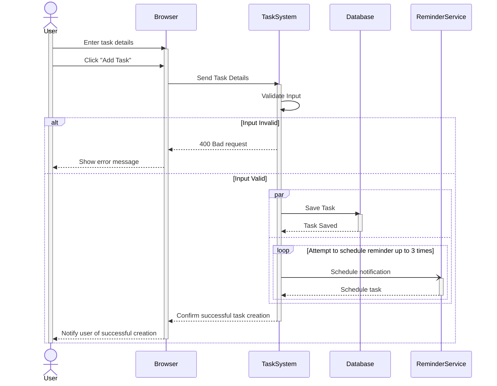

```mermaid
sequenceDiagram
    actor User
    participant Browser
    participant TaskSystem
    participant Database
    participant ReminderService

    activate User
    User->>Browser: Enter task details
    activate Browser
    User->>Browser: Click "Add Task"

    Browser->>TaskSystem: Send Task Details

    activate TaskSystem
    TaskSystem->>TaskSystem: Validate Input

    alt Input Invalid
        TaskSystem-->>Browser: 400 Bad request
        Browser-->>User: Show error message
    else Input Valid
        par
            TaskSystem->>Database: Save Task
            activate Database
            Database-->>TaskSystem: Task Saved
            deactivate Database
        and
            loop Attempt to schedule reminder up to 3 times
                TaskSystem-)ReminderService: Schedule notification
                activate ReminderService
                ReminderService-->>TaskSystem: Schedule task
                deactivate ReminderService
            end
        end

        TaskSystem-->>Browser: Confirm successful task creation
        deactivate TaskSystem

        Browser-->>User: Notify user of successful creation
        deactivate Browser
    end
    deactivate User
```