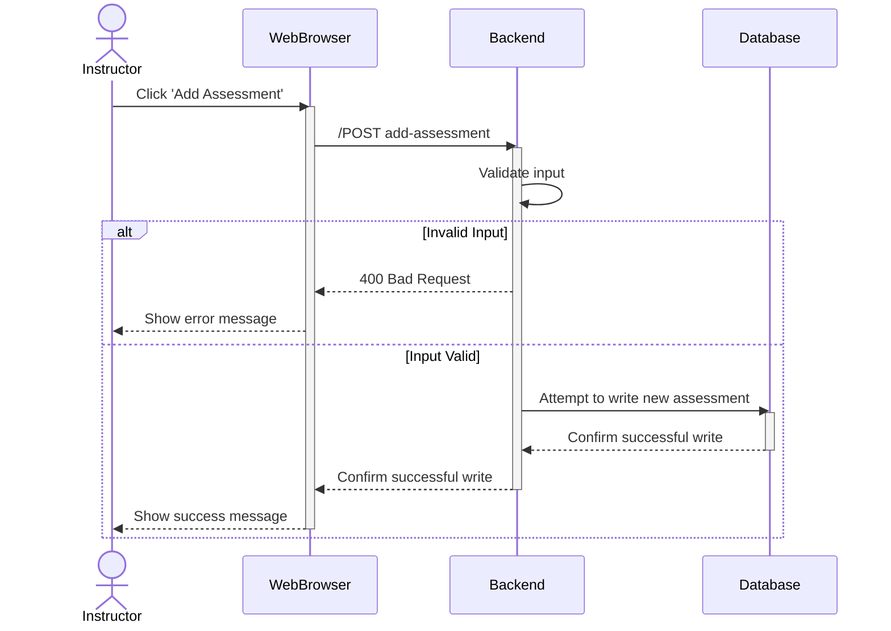

```mermaid
sequenceDiagram
    actor Instructor
    participant WebBrowser
    participant Backend
    participant Database

    Instructor->>WebBrowser: Click 'Add Assessment'
    activate WebBrowser
    WebBrowser->>Backend: /POST add-assessment
    activate Backend

    Backend->>Backend: Validate input
    alt Invalid Input
        Backend-->>WebBrowser: 400 Bad Request
        WebBrowser-->>Instructor: Show error message
    else Input Valid
        Backend->>Database: Attempt to write new assessment
        activate Database
        Database-->>Backend: Confirm successful write
        deactivate Database
        Backend-->>WebBrowser: Confirm successful write
        deactivate Backend
        WebBrowser-->>Instructor: Show success message
        deactivate WebBrowser
    end

```