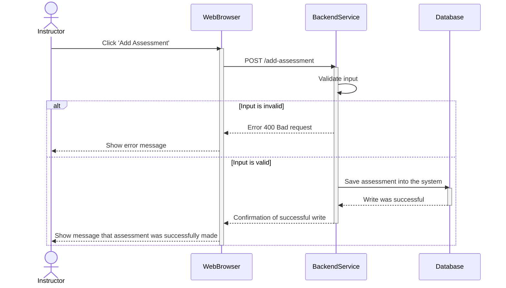

```mermaid
sequenceDiagram
    # You should declare your actor and components in the order that messages will be communicated.
    # For example, if the message order will be User -> A -> B -> C, you should declare the User (actor)
    # first, then A, B and C (the participants).
    actor Instructor
    participant WebBrowser
    participant BackendService
    participant Database

    # ->> denotes a synchronous request - this should almost always be followed up by some sort of
    # response later down the line, denoted by -->>
    Instructor->>WebBrowser: Click 'Add Assessment'

    # This creates the activation box, since the web browser is now active.
    # This must be followed by a deactivate WebBrowser later down the line.
    # Activation order works like a stack; the most recently activated component will also be the next
    # component that should be deactivated.
    activate WebBrowser
    WebBrowser->>BackendService: POST /add-assessment # POST HTTP request
    activate BackendService
    BackendService->>BackendService: Validate input

    # Branching conditions; general structure is alt ... else ... end
    alt Input is invalid
        BackendService-->>WebBrowser: Error 400 Bad request
        WebBrowser-->>Instructor: Show error message
    else Input is valid
        BackendService->>Database: Save assessment into the system
        activate Database
        Database-->>BackendService: Write was successful
        deactivate Database
        BackendService-->>WebBrowser: Confirmation of successful write
        deactivate BackendService
        WebBrowser-->>Instructor: Show message that assessment was successfully made
    end

    deactivate WebBrowser 
```