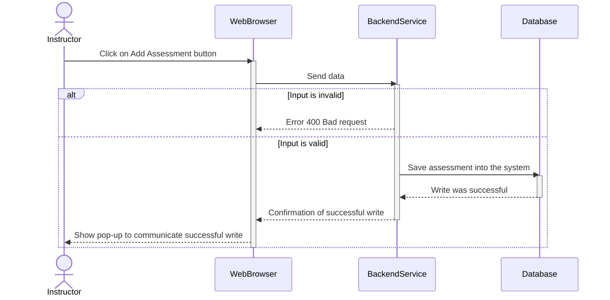

```mermaid
sequenceDiagram
    actor Instructor
    participant WebBrowser
    participant BackendService
    participant Database

    Instructor->>WebBrowser: Click on Add Assessment button
    activate WebBrowser
    WebBrowser->>BackendService: Send data
    activate BackendService

    alt Input is invalid
    BackendService-->>WebBrowser: Error 400 Bad request
    else Input is valid
    BackendService->>Database: Save assessment into the system
    activate Database
    Database-->>BackendService: Write was successful
    deactivate Database
    BackendService-->>WebBrowser: Confirmation of successful write
    deactivate BackendService
    WebBrowser-->>Instructor: Show pop-up to communicate successful write
    end
    deactivate WebBrowser 
```