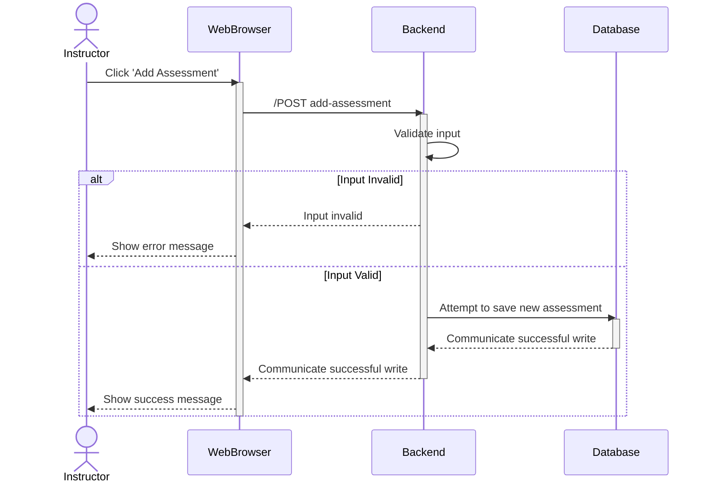

```mermaid
sequenceDiagram
    actor Instructor
    participant WebBrowser
    participant Backend
    participant Database

    Instructor->>WebBrowser: Click 'Add Assessment'
    activate WebBrowser
    WebBrowser->>Backend: /POST add-assessment
    activate Backend
    Backend->>Backend: Validate input

    alt Input Invalid
    Backend-->>WebBrowser: Input invalid
    WebBrowser-->>Instructor: Show error message
    else Input Valid
    Backend->>Database: Attempt to save new assessment
    activate Database
    Database-->>Backend: Communicate successful write
    deactivate Database
    Backend-->>WebBrowser: Communicate successful write
    deactivate Backend
    WebBrowser-->>Instructor: Show success message
    end
    
    deactivate WebBrowser
```