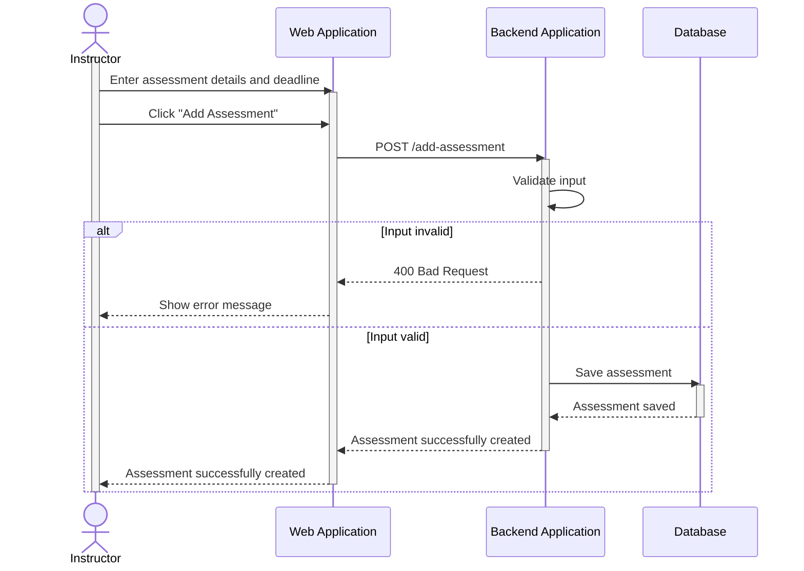

```mermaid
sequenceDiagram
    actor Instructor
    participant WA as Web Application
    participant BA as Backend Application
    participant Database

    activate Instructor
    Instructor->>WA: Enter assessment details and deadline
    activate WA
    Instructor->>WA: Click "Add Assessment"
    WA->>BA: POST /add-assessment
    
    activate BA
    BA->>BA: Validate input

    alt Input invalid
        BA-->>WA: 400 Bad Request
        WA-->>Instructor: Show error message
    else Input valid
        BA->>Database: Save assessment
        activate Database
        Database-->>BA: Assessment saved
        deactivate Database

        BA-->>WA: Assessment successfully created

        deactivate BA

        WA-->>Instructor: Assessment successfully created

        deactivate WA
    end
    deactivate Instructor
```