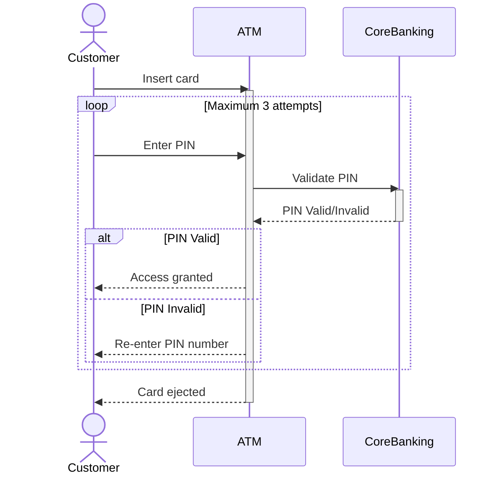

```mermaid
sequenceDiagram
    actor Customer
    participant ATM
    participant CoreBanking

    Customer->>ATM: Insert card
    activate ATM
    loop Maximum 3 attempts
        Customer->>ATM: Enter PIN
        ATM ->>CoreBanking: Validate PIN
        activate CoreBanking
        CoreBanking-->>ATM: PIN Valid/Invalid
        deactivate CoreBanking

        alt PIN Valid
            ATM-->>Customer: Access granted
        else PIN Invalid
            ATM-->>Customer: Re-enter PIN number
        end
    end

    ATM-->>Customer: Card ejected
    deactivate ATM
```