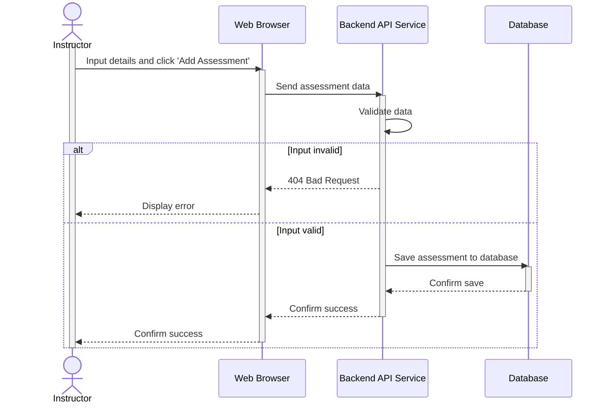

```mermaid
    sequenceDiagram

    actor Instructor
    participant Web Browser
    participant Backend API Service
    participant Database

    activate Instructor
    Instructor->>Web Browser: Input details and click 'Add Assessment'
    activate Web Browser
    Web Browser->>Backend API Service: Send assessment data
    activate Backend API Service

    Backend API Service->>Backend API Service: Validate data

    alt Input invalid
        Backend API Service-->>Web Browser: 404 Bad Request
        Web Browser-->>Instructor: Display error
    else Input valid
        Backend API Service->>Database: Save assessment to database
        activate Database
        Database-->>Backend API Service: Confirm save
        deactivate Database
        Backend API Service-->>Web Browser: Confirm success
        deactivate Backend API Service
        Web Browser-->>Instructor: Confirm success
        deactivate Web Browser
    end

    deactivate Instructor


```